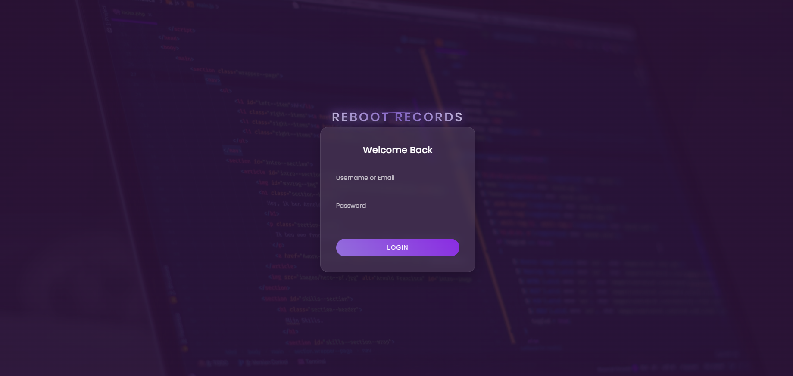
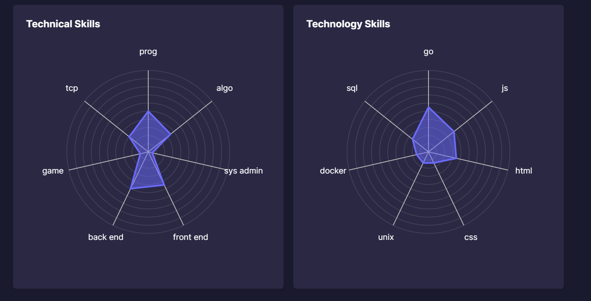

# 🚀 Reboot Records

A dynamic web application for tracking student progress and skills at Reboot01, featuring interactive visualizations and real-time data analytics.



## ✨ Features

### 📊 Dynamic Data Visualization
- **XP Progress Tracking**: Interactive graph showing your learning journey
- **Skills Radar**: Visual representation of technical and technology skills
- **Audit Statistics**: Comprehensive view of audit performance and ratio

### 🎨 User Interface
- **Dark/Light Theme**: Toggle between themes for comfortable viewing
- **Responsive Design**: Seamless experience across all devices
- **Animated Particles**: Dynamic background effects
- **Glass Morphism**: Modern, sleek UI components

### 🔐 Security
- **JWT Authentication**: Secure user sessions
- **Protected Routes**: Authenticated access to user data
- **GraphQL Integration**: Efficient data querying

### 🎮 Mini Games
- **Codymon Catcher**: A fun Pokemon-inspired game
- **Pac-man**: Classic arcade action reimagined

## 🛠️ Technologies Used

- **Frontend**:
  - HTML5
  - CSS3 (with custom animations)
  - JavaScript (ES6+)
  - Chart.js
  - D3.js

- **Backend Integration**:
  - GraphQL
  - Apollo Client
  - JWT Authentication

## 🚀 Getting Started

1. **Clone the repository**
   ```bash
   git clone https://github.com/yourusername/reboot-records.git
   ```

2. **Install dependencies**
   ```bash
   npm install
   ```

3. **Set up environment variables**
   ```bash
   cp .env.example .env
   # Edit .env with your credentials
   ```

4. **Run the application**
   ```bash
   npm start
   ```

## 📱 Screenshots

<div align="center">
  
  
</div>

## 🌟 Features in Detail

### Profile Dashboard
- Comprehensive user statistics
- XP progression tracking
- Skill development visualization

### Audit System
- Real-time audit ratio calculation
- Passed/Failed audit history
- Interactive audit statistics

### Skills Tracking
- Technical skills radar chart
- Technology proficiency visualization
- Progress tracking over time

## 🎮 Integrated Games

### Codymon Catcher
A Pokemon-inspired catching game where players can test their skills and reflexes. 
- **Live Demo**: [Play Codymon Catcher](https://codymon-catcher.vercel.app/)

### Pac-man
A modern take on the classic arcade game, featuring smooth controls and nostalgic gameplay.
- **Live Demo**: [Play Pac-man](https://pac-man-mocha.vercel.app/)

## 📝 License

This project is licensed under the MIT License - see the [LICENSE](LICENSE) file for details.

## 👨‍💻 Author

**Yousif Maidan**
- GitHub: [@ymaidan](https://github.com/ymaidan)
- LinkedIn: [Yousif Maidan](https://www.linkedin.com/in/yousif-maidan-580794288/)

## 🙏 Acknowledgments

- Reboot01 for providing the learning platform
- The open-source community for amazing tools and libraries
- All contributors who helped improve this project

---

<div align="center">
  Made with ❤️ at Reboot01
</div> 